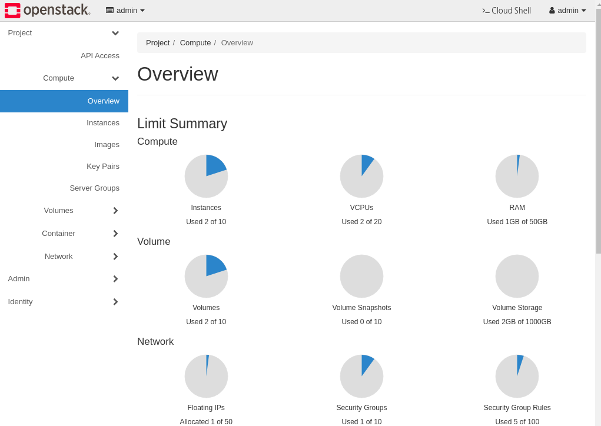
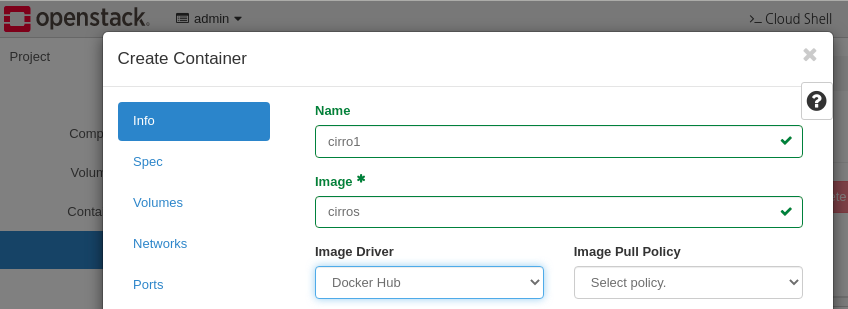
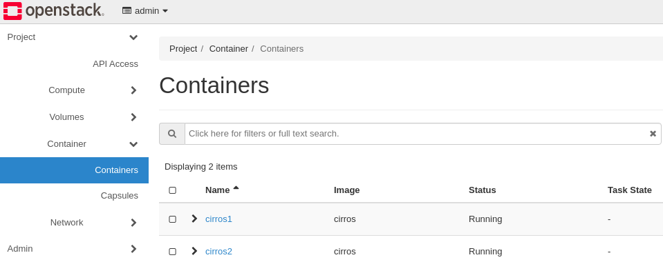

# Introduction
This guide describes things like the following:
1. how to install OpenStack with zun and kata on ubuntu 20.04 using devstack.       
   - Network driver is ovn
    
2. Navigate and manage the dashboard.    
   - Login
   - Create network
   - Create containers
   - Check the status of containers are running.

3. Network test between containers with cli.   
   - Check the list of containers.
   - Check source/destination ips from containers.
   - Ping between containers.

## Setup OpenStack environment with zun and kaka
```sh
sudo -i
hostnamectl set-hostname zun-kata.test.com
hostnamectl set-hostname zun-kata.test.com --transient


HOST_IP="$(ip -4 -o a | grep brd | head -n1 | awk '{print $4}' | cut -f1 -d'/')"
sudo echo "$HOST_IP  zun-kata.test.com zun-kata" >> /etc/hosts

useradd -s /bin/bash -d /opt/stack -m stack
echo "stack ALL=(ALL) NOPASSWD: ALL" | sudo tee /etc/sudoers.d/stack

su - stack

git clone https://github.com/openstack-dev/devstack /opt/stack/devstack
git clone https://github.com/openstack/zun /opt/stack/zun

cp /opt/stack/zun/devstack/local.conf.sample /opt/stack/devstack/local.conf
cd /opt/stack/devstack

HOST_IP="$(ip -4 -o a | grep brd | head -n1 | awk '{print $4}' | cut -f1 -d'/')"
sed -i "s/HOST_IP=.*/HOST_IP=$HOST_IP/" /opt/stack/devstack/local.conf
sed -i "s/\# ENABLE_KATA_CONTAINERS=True/ENABLE_KATA_CONTAINERS=True/" /opt/stack/devstack/local.conf
sed -i "s/\# enable_plugin zun-ui .*/enable_plugin zun-ui https:\/\/opendev.org\/openstack\/zun-ui \$TARGET_BRANCH/" /opt/stack/devstack/local.conf

./stack.sh
```

## Navigate and manage dashboard
### 1. login Page   


### 2. Overivew   


### 3. Create network   


## 4. Create two cirros containers

### 4.1 Enter name and images.   


### 4.2 Choose the network   


### 4.3 Check the running container   


## Network test between containers with CLI
```sh
$ zun list
+--------------------------------------+---------+--------+---------+------------+--------------+-------+
| uuid                                 | name    | image  | status  | task_state | addresses    | ports |
+--------------------------------------+---------+--------+---------+------------+--------------+-------+
| 315cde59-1d03-4cf3-ad40-7a0b8000d83b | cirros1 | cirros | Running | None       | 55.55.55.222 | []    |
| 60a6347e-9e2a-41e7-8967-b6d7e15dde48 | cirros2 | cirros | Running | None       | 55.55.55.108 | []    |
+--------------------------------------+---------+--------+---------+------------+--------------+-------+

$ docker ps | grep zun
ee8aae72bb49   cirros:latest   "/sbin/init"   27 minutes ago   Up 27 minutes             zun-60a6347e-9e2a-41e7-8967-b6d7e15dde48
9ecad347d918   cirros:latest   "/sbin/init"   27 minutes ago   Up 27 minutes             zun-315cde59-1d03-4cf3-ad40-7a0b8000d83b

$ docker exec ee8aae72bb49 ip a
1: lo: <LOOPBACK,UP,LOWER_UP> mtu 65536 qdisc noqueue qlen 1000
    link/loopback 00:00:00:00:00:00 brd 00:00:00:00:00:00
    inet 127.0.0.1/8 scope host lo
       valid_lft forever preferred_lft forever
    inet6 ::1/128 scope host 
       valid_lft forever preferred_lft forever
2: dummy0: <BROADCAST,NOARP> mtu 1500 qdisc noop qlen 1000
    link/ether b2:e2:87:4e:9a:c4 brd ff:ff:ff:ff:ff:ff
3: eth0: <BROADCAST,MULTICAST,UP,LOWER_UP> mtu 1442 qdisc fq qlen 1000
    link/ether fa:16:3e:1a:99:04 brd ff:ff:ff:ff:ff:ff
    inet 55.55.55.108/24 brd 55.55.55.255 scope global eth0
       valid_lft forever preferred_lft forever
    inet6 fe80::f816:3eff:fe1a:9904/64 scope link 
       valid_lft forever preferred_lft forever

$ docker exec ee8aae72bb49 ping 55.55.55.222
PING 55.55.55.222 (55.55.55.222): 56 data bytes
64 bytes from 55.55.55.222: seq=0 ttl=64 time=2.383 ms
64 bytes from 55.55.55.222: seq=1 ttl=64 time=0.751 ms
64 bytes from 55.55.55.222: seq=2 ttl=64 time=0.368 ms
64 bytes from 55.55.55.222: seq=3 ttl=64 time=0.462 ms
^C
```


# Below lines from this will be managed on another page.
#### Adding port(ens4) to the external bridge(br-ex)
```sh
ovs-vsctl --may-exist add-br br-ex -- set bridge br-ex \
  protocols=OpenFlow13
```

#### Mapping pubilc:br-ex to go though external.
```sh
ovs-vsctl set open . external-ids:ovn-bridge-mappings=public:br-ex
ovs-vsctl --may-exist add-port br-ex ens4
```
#### Creating external network named public 
```sh
openstack network create --external --share \
  --provider-physical-network public --provider-network-type flat \
  public
```
#### Creating ip range for external network
```sh
openstack subnet create --network public --subnet-range \
  192.168.103.0/24 --allocation-pool start=192.168.103.151,end=192.168.103.160 \
  --dns-nameserver 8.8.8.8 --gateway 192.168.103.1 public-sub
```  
  
