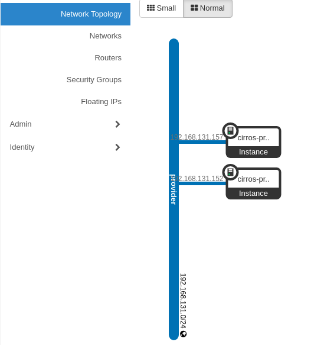
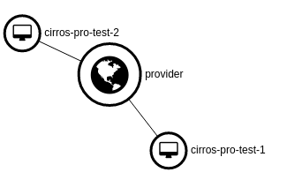
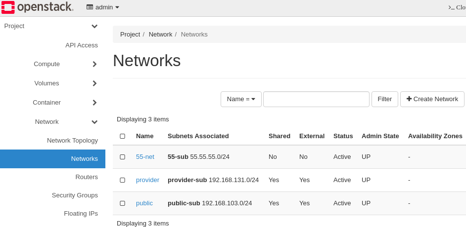
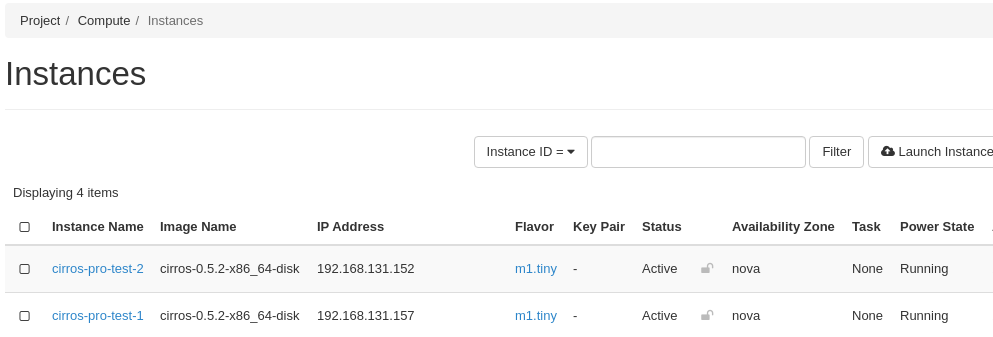
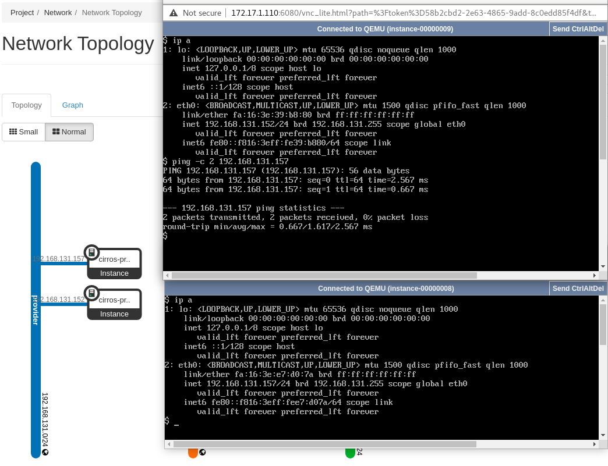

# Introduction   
This guide describes verification of provider network like the following:   
1. Manage provider bridge and port with ovs-vsctl 
   - add-br   
   - add-port           
2. Manage provider L2 network, and vm with dashboared.       
   - Login
   - Create provider network
   - Create two VM with provider type network
5. Provider network connection test with CLI     
   - provider network test

# Add physnet public2 for new provider network.   
##### Add physnet public2 to the parameter flat_networks and network_vlan_ranges in ml2_conf.ini for adding new provider network.    

```sh
$ sudo vi /etc/neutron/plugins/ml2/ml2_conf.ini 
...
flat_networks = public,public2
network_vlan_ranges = public,public2
...
```

# Add bridge named br-ex2
#### Add port(ens10) to the provider bridge(br-ex2) and see if it is added well.   
```sh
$ sudo ovs-vsctl --may-exist add-br br-ex2 -- set bridge br-ex2 protocols=OpenFlow13
$ sudo ovs-vsctl list-br
br-ex
br-ex2
br-int
```

#### Map pubilc2:br-ex2 to go through L2 provider network.  
```sh
$ sudo ovs-vsctl set open . external-ids:ovn-bridge-mappings=public2:br-ex2
$ sudo ovs-vsctl --may-exist add-port br-ex2 ens10
$ sudo ovs-vsctl show
  ...
  Bridge br-ex2
      Port ens10
          Interface ens10
      Port br-ex2
          Interface br-ex2
            type: internal
```

#### Create a provider network and see if it is created well.   
```sh
$ openstack network create --external --share --provider-physical-network public2 --provider-network-type flat \
  provider
$ openstack network list
+--------------------------------------+----------+----------------------------------------------------------------------------+
| ID                                   | Name     | Subnets                                                                    |
+--------------------------------------+----------+----------------------------------------------------------------------------+
| 3d7fbd2b-6f1d-4972-9127-7d33dafd3ee6 | private  | 1517c1ed-c207-4cd1-9ec6-8b17e6fa27af, 9cda2e6a-bc35-4314-9ac1-9fd6bc999978 |
| aab6f9bb-fbc8-4eb9-837c-d3e5179c756a | provider |                                                                            |
| e1f9dcdf-39ee-450c-a444-212c1ef5b219 | public   | 99b8c08c-ef42-4714-a357-c81441d33e0e                                       |
| edfbd351-234e-478b-b4d9-e3bdf6413c60 | 55-net   | 96ab7ec2-02c7-4718-abcd-6455491f1dbb                                       |
+--------------------------------------+----------+----------------------------------------------------------------------------+  
```

#### Create ip range for provider network and see if it is created well.
```sh
$ openstack subnet create --network provider --subnet-range \
  192.168.131.0/24 --allocation-pool start=192.168.131.151,end=192.168.131.160 \
  --dns-nameserver 8.8.8.8 --gateway 192.168.131.1 provider-sub
  
$ openstack subnet list
+--------------------------------------+---------------------+--------------------------------------+---------------------+
| ID                                   | Name                | Network                              | Subnet              |
+--------------------------------------+---------------------+--------------------------------------+---------------------+
| 41bb7eb9-365c-4351-999c-7b9da1297654 | provider-sub        | aab6f9bb-fbc8-4eb9-837c-d3e5179c756a | 192.168.131.0/24    |
| 96ab7ec2-02c7-4718-abcd-6455491f1dbb | 55-sub              | edfbd351-234e-478b-b4d9-e3bdf6413c60 | 55.55.55.0/24       |
| 99b8c08c-ef42-4714-a357-c81441d33e0e | public-sub          | e1f9dcdf-39ee-450c-a444-212c1ef5b219 | 192.168.103.0/24    |
+--------------------------------------+---------------------+--------------------------------------+---------------------+

$ openstack network list
+--------------------------------------+----------+----------------------------------------------------------------------------+
| ID                                   | Name     | Subnets                                                                    |
+--------------------------------------+----------+----------------------------------------------------------------------------+
| 3d7fbd2b-6f1d-4972-9127-7d33dafd3ee6 | private  | 1517c1ed-c207-4cd1-9ec6-8b17e6fa27af, 9cda2e6a-bc35-4314-9ac1-9fd6bc999978 |
| aab6f9bb-fbc8-4eb9-837c-d3e5179c756a | provider | 41bb7eb9-365c-4351-999c-7b9da1297654                                       |
| e1f9dcdf-39ee-450c-a444-212c1ef5b219 | public   | 99b8c08c-ef42-4714-a357-c81441d33e0e                                       |
| edfbd351-234e-478b-b4d9-e3bdf6413c60 | 55-net   | 96ab7ec2-02c7-4718-abcd-6455491f1dbb                                       |
+--------------------------------------+----------+----------------------------------------------------------------------------+
```  


# Manage provider network, and vm with dashboared.
#### network environment:   
  - provider network :    
    name : provider   
    subnet : 192.168.131.0/24   
    IP Allocation Pools : Start 192.168.131.151 - End 192.168.131.160   
    Gateway IP : 192.168.131.1   
  - provider network topology:   
    
  - provider network topology graph:   
   


### 1. Network Page   
Create networks shown from the picture.   


### 2. Instances Page   
Create instances shown from the picture.


### 3. Security Group Rule Page
Add and remove rules shown from the picture
All traffic of ingress and egress will be passed after updating Security Group Rules.


# Network connection test with CLI 
## Provider network test scenario:
#### Provider network test:   
  Ping from cirros-pro-1 instance to cirros-pro-2 instance.   
  1. Ping between provider network in VM.   
  192.168.131.152 -> 192.168.131.157
  
  2. Ping from laptop(192.168.131.1) to provider network on VM. 
  192.168.131.1 -> 192.168.131.152
  192.168.131.1 -> 192.168.131.157


### Test result of provider network:
1. Ping between provider network in VM.  
192.168.131.152 -> 192.168.131.157




2. Ping from laptop(192.168.131.1) to provider network on VM. 
192.168.131.1 -> 192.168.131.152
192.168.131.1 -> 192.168.131.157

```sh
# ip a show virbr12
15: virbr12: <BROADCAST,MULTICAST,UP,LOWER_UP> mtu 1500 qdisc noqueue state UP group default qlen 1000
    link/ether 52:54:00:49:c6:3e brd ff:ff:ff:ff:ff:ff
    inet 192.168.131.1/24 brd 192.168.131.255 scope global virbr12
       valid_lft forever preferred_lft forever

# ping -c 2 192.168.131.152
PING 192.168.131.152 (192.168.131.152) 56(84) bytes of data.
64 bytes from 192.168.131.152: icmp_seq=1 ttl=64 time=1.24 ms
64 bytes from 192.168.131.152: icmp_seq=2 ttl=64 time=0.857 ms

--- 192.168.131.152 ping statistics ---
2 packets transmitted, 2 received, 0% packet loss, time 1001ms
rtt min/avg/max/mdev = 0.857/1.051/1.246/0.197 ms


# ping -c 2 192.168.131.157
PING 192.168.131.157 (192.168.131.157) 56(84) bytes of data.
64 bytes from 192.168.131.157: icmp_seq=1 ttl=64 time=2.40 ms
64 bytes from 192.168.131.157: icmp_seq=2 ttl=64 time=0.672 ms

--- 192.168.131.157 ping statistics ---
2 packets transmitted, 2 received, 0% packet loss, time 1002ms
rtt min/avg/max/mdev = 0.672/1.536/2.401/0.865 ms


```
