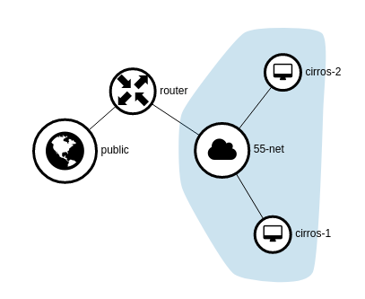

# Introduction
This guide describes things like the following:   
1. Demonstrate how to set external network with br-ex bridge and physical interface.          
2. Manage networks, and VMs with dashboared.     
   - Login
   - Create public network
   - Create private network
   - Create router
   - Add interfaces to router
   - Create two VM with public and private network
3. Network connection test with CLI   
   - Priavate network test
   - Public network test
   - Add a rule to be ping available

# Setting an external network with br-ex bridge and physical interface.
#### Adding port(ens4) to the external bridge(br-ex)
```sh
ovs-vsctl --may-exist add-br br-ex -- set bridge br-ex \
  protocols=OpenFlow13
```

#### Mapping pubilc:br-ex to go through an external.
```sh
ovs-vsctl set open . external-ids:ovn-bridge-mappings=public:br-ex
ovs-vsctl --may-exist add-port br-ex ens4
```
#### Creating external network named public.
```sh
openstack network create --external --share \
  --provider-physical-network public --provider-network-type flat \
  public
```
#### Creating ip range for external network.
```sh
openstack subnet create --network public --subnet-range \
  192.168.103.0/24 --allocation-pool start=192.168.103.151,end=192.168.103.160 \
  --dns-nameserver 8.8.8.8 --gateway 192.168.103.1 public-sub
```  

# Manage networks, and VMs with dashboared.
#### network environment:   
  - public network :    
    name : public   
    subnet : 192.168.103.0/24   
    IP Allocation Pools : Start 192.168.103.151 - End 192.168.103.160   
    Gateway IP : 192.168.103.1   
  - private network :    
    name : 55-net   
    subnet : 55.55.55.0/24   
    IP Allocation Pools : Start 55.55.55.2 - End 55.55.55.254   
  - router :   
    name : router   
    interfaces : 55.55.55.1(Internal Interface), 192.168.103.160(External Gateway) 
  - network topology:   
    
  - network topology graph:   
   


### 1. Network Page   


### 2. Router Page   


### 3. Router Interfaces Page   


### 4. Instances Page   


### 5. Security Group Rule Page   


# Network connection test with CLI 
## Network test scenario:
#### Private network test:   
  Ping from cirros1 instance to cirros2 instance.   
  1. Ping between internal network.   
  55.55.55.137 -> 55.55.55.104

#### Public network test:   
  2. Ping between an internal and external network   
  55.55.55.137 -> 192.168.103.158 -> 192.168.103.157   

  3. ping between an external network   
  192.168.103.1 -> 192.168.103.157   
  192.168.103.1 -> 192.168.103.158   


### Priavate network test

Ping between internal network.   
55.55.55.137 -> 55.55.55.104   
```sh
# openstack server list -c Name -c Networks
+----------+--------------------------------------+
| Name     | Networks                             |
+----------+--------------------------------------+
| cirros-2 | 55-net=192.168.103.157, 55.55.55.104 |
| cirros-1 | 55-net=192.168.103.158, 55.55.55.137 |
+----------+--------------------------------------+

# virsh list
 Id   Name                State
-----------------------------------
 1    instance-00000006   running
 2    instance-00000007   running
 
# virsh dumpxml 1 | grep nova:name
      <nova:name>cirros-1</nova:name>

# virsh console 1
Connected to domain instance-00000006
Escape character is ^]

login as 'cirros' user. default password: 'gocubsgo'. use 'sudo' for root.
cirros-1 login: cirros
Password: 
$ ip -4 -o a
1: lo    inet 127.0.0.1/8 scope host lo\       valid_lft forever preferred_lft forever
2: eth0    inet 55.55.55.137/24 brd 55.55.55.255 scope global eth0\       valid_lft forever preferred_lft forever
--- 55.55.55.104 ping statistics ---
4 packets transmitted, 4 packets received, 0% packet loss
round-trip min/avg/max = 0.372/0.790/1.751 ms
$ ping -c 3 55.55.55.104
PING 55.55.55.104 (55.55.55.104): 56 data bytes
64 bytes from 55.55.55.104: seq=0 ttl=64 time=0.544 ms
64 bytes from 55.55.55.104: seq=1 ttl=64 time=0.594 ms
64 bytes from 55.55.55.104: seq=2 ttl=64 time=0.678 ms

--- 55.55.55.104 ping statistics ---
3 packets transmitted, 3 packets received, 0% packet loss
round-trip min/avg/max = 0.544/0.605/0.678 ms

```

### Public network test

Ping between an internal and external network   
55.55.55.137 -> 192.168.103.158 -> 192.168.103.157   

```sh
# openstack server list -c Name -c Networks
+----------+--------------------------------------+
| Name     | Networks                             |
+----------+--------------------------------------+
| cirros-2 | 55-net=192.168.103.157, 55.55.55.104 |
| cirros-1 | 55-net=192.168.103.158, 55.55.55.137 |
+----------+--------------------------------------+

# virsh console 1
Connected to domain instance-00000006
Escape character is ^]

$ ip -4 -o a
1: lo    inet 127.0.0.1/8 scope host lo\       valid_lft forever preferred_lft forever
2: eth0    inet 55.55.55.137/24 brd 55.55.55.255 scope global eth0\       valid_lft forever preferred_lft forever
$ ping -c 3 192.168.103.157
PING 192.168.103.157 (192.168.103.157): 56 data bytes
64 bytes from 192.168.103.157: seq=0 ttl=62 time=2.874 ms
64 bytes from 192.168.103.157: seq=1 ttl=62 time=0.586 ms
64 bytes from 192.168.103.157: seq=2 ttl=62 time=0.448 ms

--- 192.168.103.157 ping statistics ---
3 packets transmitted, 3 packets received, 0% packet loss
round-trip min/avg/max = 0.448/1.302/2.874 ms

```

ping between an external network   
192.168.103.1 -> 192.168.103.157   
192.168.103.1 -> 192.168.103.158   

```sh
# ip -4 -o a| grep 192.168.103
12: virbr10    inet 192.168.103.1/24 brd 192.168.103.255 scope global virbr10\       valid_lft forever preferred_lft forever

# ping -c 3 192.168.103.157
PING 192.168.103.157 (192.168.103.157) 56(84) bytes of data.
64 bytes from 192.168.103.157: icmp_seq=1 ttl=63 time=2.49 ms
64 bytes from 192.168.103.157: icmp_seq=2 ttl=63 time=0.582 ms
64 bytes from 192.168.103.157: icmp_seq=3 ttl=63 time=0.453 ms

--- 192.168.103.157 ping statistics ---
3 packets transmitted, 3 received, 0% packet loss, time 2002ms
rtt min/avg/max/mdev = 0.453/1.175/2.491/0.932 ms
[root@lbh-server ~]# ping -c 3 192.168.103.158
PING 192.168.103.158 (192.168.103.158) 56(84) bytes of data.
64 bytes from 192.168.103.158: icmp_seq=1 ttl=63 time=2.27 ms
64 bytes from 192.168.103.158: icmp_seq=2 ttl=63 time=0.471 ms
64 bytes from 192.168.103.158: icmp_seq=3 ttl=63 time=0.357 ms

--- 192.168.103.158 ping statistics ---
3 packets transmitted, 3 received, 0% packet loss, time 2001ms
rtt min/avg/max/mdev = 0.357/1.034/2.276/0.879 ms
```


