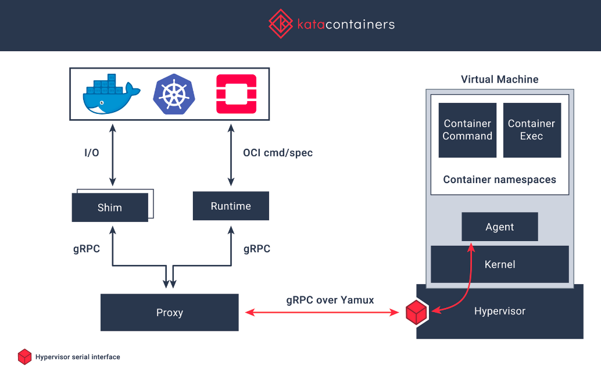
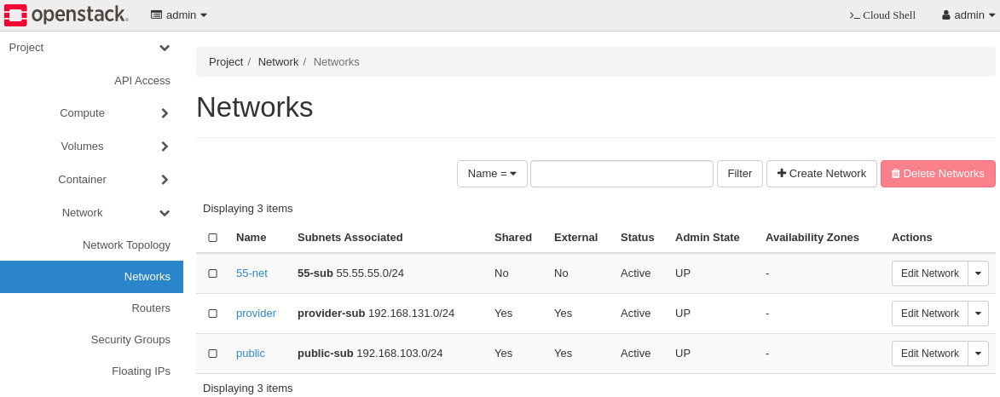
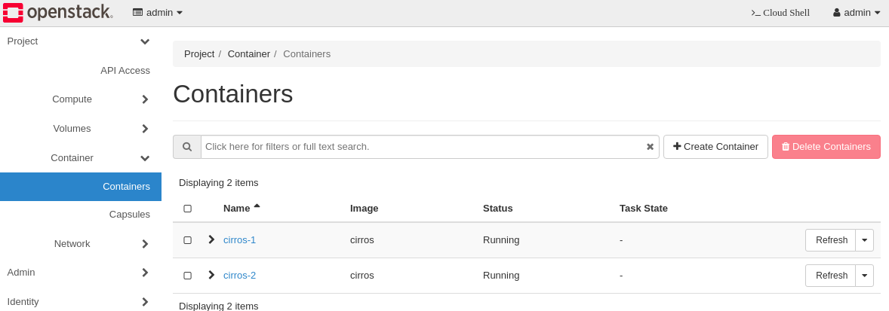

# Introduction
This page is to demonstrate and test some functions of OpenStack projects such as zun, kata, kuryr, cinder, and neutron, 
and it also provides how to set the configuration of OpenStack zun, kata, kuryr project, and nfs storage backend. 
After these configurations, we can verify some functions like the following:
 1. docker network
 2. zun container service
 3. kata runtime
 4. kuryr network for vm and container
 5. nfs volume service
 6. VMs with nfs volumes
 7. containers with nfs volumes
 8. Network verification between containers

# What are zun, kata, kuryr project?
### What is zun?
Zun is the OpenStack container service project, which aims to provide an API service for running application containers without managing servers or clusters.
Containers managed by zun are integrated with other OpenStack components, such as Neutron, Cinder, Glance, and Keystone. 

   
Figure 1. Zun Conceptual Architecture[1]


### What is kata container?
Kata container is an open source project working to build a secure container runtime with lightweight virtual machines that feel and perform like containers.
Kata container is an OCI compatiable runtime, ahdn thus plugs into both Docker and Kubenetes.

   
Figure 1. Kata Container Conceptual Architecture[2]

### What is kuryr?
Kuryr aims to be the integrations bridge between Docker and Neutron project to be able to fullfill the use cases needed spcifically to containers networking.
Kuryr leverage Neutron abstraction to be able to create virtual networks for containers.[3]

# How to install kata, zun, and kuryr.
You are easily able to install them together by following instructions from the link below.      
https://github.com/cloudmaster2010/openstack/blob/main/devstack/1.openstack-with-dev.md

# Setting nfs storage backend to use cinder volume service on containers.
### Setting nfs server   
Set the configuration to allow 172.17.1.0/24 traffics that is requested from OpenStack Cinser Service.    
```sh
$ cat /etc/exports   
/dev_nfs 172.17.1.0/24(rw,sync,no_root_squash)
```

### Setting Cinder Volume on OpenStack   

```sh
$ cat /etc/cinder/cinder.conf
[DEFAULT]
...
default_volume_type = nfs-1
enabled_backends = nfs-1
...

[nfs-1]
volume_driver = cinder.volume.drivers.nfs.NfsDriver
volume_backend_name = nfs-1
nfs_shares_config = /etc/cinder/nfs_shares
nfs_snapshot_support = True
nas_secure_file_permissions = False
nas_secure_file_operations = False
```

Update the nfs path to be defined in /etc/cinder/nfs_shares.   
```sh
$ cat /etc/cinder/nfs_shares 
172.17.1.55:/dev_nfs
```

Create volume type and backend   
```sh
$ openstack volume type create nfs
$ openstack volume type set --property volume_backend_name=nfs-1 nfs

$ openstack volume type list
+--------------------------------------+-------------+-----------+
| ID                                   | Name        | Is Public |
+--------------------------------------+-------------+-----------+
| 0090ec1d-fad2-40cc-b7f8-2e541e4b621c | __DEFAULT__ | True      |
| 26770e40-dc9e-4de9-8583-202371bf0fae | nfs         | True      |
+--------------------------------------+-------------+-----------+
$ openstack volume type show nfs
+--------------------+--------------------------------------+
| Field              | Value                                |
+--------------------+--------------------------------------+
| access_project_ids | None                                 |
| description        | None                                 |
| id                 | 26770e40-dc9e-4de9-8583-202371bf0fae |
| is_public          | True                                 |
| name               | nfs                                  |
| properties         | volume_backend_name='nfs-1'          |
| qos_specs_id       | None                                 |
+--------------------+--------------------------------------+
```

Check if the volume servic is up   
```sh
$ openstack volume service list
+------------------+----------------------+------+---------+-------+----------------------------+
| Binary           | Host                 | Zone | Status  | State | Updated At                 |
+------------------+----------------------+------+---------+-------+----------------------------+
| cinder-scheduler | zun-kata-kuryr       | nova | enabled | up    | 2022-02-19T15:02:16.000000 |
| cinder-volume    | zun-kata-kuryr@nfs-1 | nova | enabled | up    | 2022-02-19T03:32:40.000000 |
+------------------+----------------------+------+---------+-------+----------------------------+

$ sudo apt install nfs-common
```

# Update the configuration of docker with kata-runtime and see if docker daemon is running.
Update the configuration of docker with kata-runtime
```sh
$ cat /etc/docker/daemon.json 
{
    "cluster-store": "etcd://172.17.1.110:2379",
    "runtimes": {
                "kata-runtime": {
                    "path": "/usr/bin/kata-runtime"
                }
            },
            "default-runtime": "kata-runtime",
    "debug": true,
    "live-restore": false,
    "ipv6": false,
    "group": "stack",
    "hosts": [
        "unix:///var/run/docker.sock",
        "tcp://0.0.0.0:2375"
    ]
}

$ cat /etc/systemd/system/docker.service.d/docker.conf 
[Service]
ExecStart=
ExecStart=/usr/bin/dockerd --config-file=/etc/docker/daemon.json --cluster-advertise=172.17.1.110:2375
```

Check if the docker is running.   
```sh
$ systemctl status docker
● docker.service - Docker Application Container Engine
     Loaded: loaded (/lib/systemd/system/docker.service; enabled; vendor preset: enabled)
    Drop-In: /etc/systemd/system/docker.service.d
             └─docker.conf
     Active: active (running) since Sat 2022-02-19 15:28:47 UTC; 29min ago
...
``` 


# Identify the configurations of kuryr and see if related service daemons are running.
Check if the related values are correct and path exists.     
```sh
$ egrep -v "^$|^#" /etc/kuryr/kuryr.conf 
[DEFAULT]
debug = True
bindir = /usr/local/libexec/kuryr
process_external_connectivity = False
capability_scope = global
[binding]
[neutron]
memcached_servers = localhost:11211
cafile = /opt/stack/data/ca-bundle.pem
project_domain_name = Default
project_name = service
user_domain_name = Default
password = password
username = kuryr
auth_url = http://172.17.1.110/identity
interface = public
auth_type = password

```

Check if the kuryr-libnetwork.service is active (running).   
```sh
$ sudo systemctl status devstack@kuryr-libnetwork.service
● devstack@kuryr-libnetwork.service - Devstack devstack@kuryr-libnetwork.service
     Loaded: loaded (/etc/systemd/system/devstack@kuryr-libnetwork.service; enabled; vendor preset: enab>
     Active: active (running) since Sat 2022-02-19 15:28:27 UTC; 7min ago
...
```
# Identify the configurations of zun and see if related service daemons are running.
Run below command and see if the zun related service daemons are running.
```sh
$ sudo systemctl list-units | grep devstack@zun*
  devstack@zun-api.service                                                                  loaded active     running         Devstack devstack@zun-api.service                                                          
  devstack@zun-cni-daemon.service                                                           loaded active     running         Devstack devstack@zun-cni-daemon.service                                                   
  devstack@zun-compute.service                                                              loaded active     running         Devstack devstack@zun-compute.service                                                      
  devstack@zun-wsproxy.service                                                              loaded active     running         Devstack devstack@zun-wsproxy.service
```

# Functional Test
#### Create containers by using zun command, and test the network connection between provider network.    
1. Check the provider network for containers, You can also use the tenant network but at this time, we will use the provider network.
   
2. Create VM with cirros image and provider network we created earlier. 
 
3. Check the list of containers by using zun and docker command.
```sh
$ zun list
+--------------------------------------+----------+--------+---------+------------+-----------------+-------+
| uuid                                 | name     | image  | status  | task_state | addresses       | ports |
+--------------------------------------+----------+--------+---------+------------+-----------------+-------+
| 80a7fa9d-d15e-49ae-83f1-b771b05f21e6 | cirros-2 | cirros | Running | None       | 192.168.131.156 | []    |
| 546ce917-4c76-4074-be53-4547e3520633 | cirros-1 | cirros | Running | None       | 192.168.131.154 | []    |
+--------------------------------------+----------+--------+---------+------------+-----------------+-------+
$ docker ps | grep zun
f12bfdbb4332   cirros:latest   "/sbin/init"   17 minutes ago   Up 17 minutes             zun-546ce917-4c76-4074-be53-4547e3520633
2b9a2bd10d39   cirros:latest   "/sbin/init"   17 minutes ago   Up 17 minutes             zun-80a7fa9d-d15e-49ae-83f1-b771b05f21e6
```

ping from cirros-1(192.168.131.154) to cirros-2(192.168.131.156)   
```sh
$ docker exec -it zun-546ce917-4c76-4074-be53-4547e3520633 ping -c 2 192.168.131.156
PING 192.168.131.156 (192.168.131.156): 56 data bytes
64 bytes from 192.168.131.156: seq=0 ttl=64 time=0.880 ms
64 bytes from 192.168.131.156: seq=1 ttl=64 time=0.941 ms

--- 192.168.131.156 ping statistics ---
2 packets transmitted, 2 packets received, 0% packet loss
round-trip min/avg/max = 0.880/0.910/0.941 ms
```

ping from laptop(192.168.131.1) to cirros-1(192.168.131.154) and cirros-2(192.168.131.156).   
```sh
$ ip -4 -o a show virbr12
11: virbr12    inet 192.168.131.1/24 brd 192.168.131.255 scope global virbr12\       valid_lft forever preferred_lft forever
$ ping -c 2 192.168.131.154
PING 192.168.131.154 (192.168.131.154) 56(84) bytes of data.
64 bytes from 192.168.131.154: icmp_seq=1 ttl=64 time=0.829 ms
64 bytes from 192.168.131.154: icmp_seq=2 ttl=64 time=0.680 ms

--- 192.168.131.154 ping statistics ---
2 packets transmitted, 2 received, 0% packet loss, time 1000ms
rtt min/avg/max/mdev = 0.680/0.754/0.829/0.079 ms

$ ping -c 2 192.168.131.156
PING 192.168.131.156 (192.168.131.156) 56(84) bytes of data.
64 bytes from 192.168.131.156: icmp_seq=1 ttl=64 time=0.910 ms
64 bytes from 192.168.131.156: icmp_seq=2 ttl=64 time=0.588 ms

--- 192.168.131.156 ping statistics ---
2 packets transmitted, 2 received, 0% packet loss, time 1000ms
rtt min/avg/max/mdev = 0.588/0.749/0.910/0.161 ms
```

#### Create containers with volume, and see if the volume is attached named app. 
Check the list of containers.   
```sh
$ zun list
+--------------------------------------+-------------------+--------+---------+------------+-----------------+-------+
| uuid                                 | name              | image  | status  | task_state | addresses       | ports |
+--------------------------------------+-------------------+--------+---------+------------+-----------------+-------+
| 80a7fa9d-d15e-49ae-83f1-b771b05f21e6 | cirros-2          | cirros | Running | None       | 192.168.131.156 | []    |
| 546ce917-4c76-4074-be53-4547e3520633 | cirros-1          | cirros | Running | None       | 192.168.131.154 | []    |
| 4a3738ed-740f-4c47-9dc6-3db986054906 | cirros-with-vol-1 | cirros | Running | None       | 192.168.131.160 | []    |
| 2488bb37-f62a-438d-8d10-fba6b8444a6a | cirros-with-vol-2 | cirros | Running | None       | 192.168.131.153 | []    |
+--------------------------------------+-------------------+--------+---------+------------+-----------------+-------+
```

Cehck the list of volumes that are attached to containers.   
```sh
$ openstack volume list -c Name -c Status -c Size -c "Attached to"
+------+-----------+------+--------------------------------------------------------------------------------------------------------------------------------------------------------------+
| Name | Status    | Size | Attached to                                                                                                                                                  |
+------+-----------+------+--------------------------------------------------------------------------------------------------------------------------------------------------------------+
| nfs3 | available |    1 |                                                                                                                                                              |
| nfs2 | in-use    |    1 | Attached to 2488bb37-f62a-438d-8d10-fba6b8444a6a on /opt/stack/data/cinder/mnt/1dc2bd37cf510ed76598582289c5242f/volume-a799036d-546c-4060-be3f-64898867fbed  |
| nfs1 | in-use    |    1 | Attached to 4a3738ed-740f-4c47-9dc6-3db986054906 on /opt/stack/data/cinder/mnt/1dc2bd37cf510ed76598582289c5242f/volume-dee4140e-4636-4350-bf13-d77f3487cd59  |
+------+-----------+------+--------------------------------------------------------------------------------------------------------------------------------------------------------------+
```

Check the list of contains running on docker.   
```sh
$ docker ps | grep zun
22cdcaafb8df   cirros:latest   "/sbin/init"   3 minutes ago   Up 3 minutes              zun-2488bb37-f62a-438d-8d10-fba6b8444a6a
7f25975cfaab   cirros:latest   "/sbin/init"   4 minutes ago   Up 4 minutes              zun-4a3738ed-740f-4c47-9dc6-3db986054906
f12bfdbb4332   cirros:latest   "/sbin/init"   2 hours ago     Up 18 seconds             zun-546ce917-4c76-4074-be53-4547e3520633
2b9a2bd10d39   cirros:latest   "/sbin/init"   2 hours ago     Up 15 seconds             zun-80a7fa9d-d15e-49ae-83f1-b771b05f21e6
```

Check the attached volume named app in container.   
```sh
$ docker exec -it zun-4a3738ed-740f-4c47-9dc6-3db986054906 df -h
Filesystem                Size      Used Available Use% Mounted on
kataShared               26.5G     17.5G      7.6G  70% /
tmpfs                    64.0M         0     64.0M   0% /dev
tmpfs                   995.9M         0    995.9M   0% /sys/fs/cgroup
kataShared              975.9M      2.5M    906.2M   0% /app
kataShared               26.5G     17.5G      7.6G  70% /etc/resolv.conf
kataShared               26.5G     17.5G      7.6G  70% /etc/hostname
kataShared               26.5G     17.5G      7.6G  70% /etc/hosts
shm                      64.0M         0     64.0M   0% /dev/shm
tmpfs                   995.9M         0    995.9M   0% /proc/acpi
tmpfs                    64.0M         0     64.0M   0% /proc/keys
tmpfs                    64.0M         0     64.0M   0% /proc/timer_list
tmpfs                   995.9M         0    995.9M   0% /sys/firmware
```

#### Check how docker networks are connected with neutron networks using CLI. 
Get the list of neutron networks.
```sh
$ openstack network list
+--------------------------------------+----------+----------------------------------------------------------------------------+
| ID                                   | Name     | Subnets                                                                    |
+--------------------------------------+----------+----------------------------------------------------------------------------+
| 3d7fbd2b-6f1d-4972-9127-7d33dafd3ee6 | private  | 1517c1ed-c207-4cd1-9ec6-8b17e6fa27af, 9cda2e6a-bc35-4314-9ac1-9fd6bc999978 |
| aab6f9bb-fbc8-4eb9-837c-d3e5179c756a | provider | 41bb7eb9-365c-4351-999c-7b9da1297654                                       |
| e1f9dcdf-39ee-450c-a444-212c1ef5b219 | public   | 99b8c08c-ef42-4714-a357-c81441d33e0e                                       |
| edfbd351-234e-478b-b4d9-e3bdf6413c60 | 55-net   | 96ab7ec2-02c7-4718-abcd-6455491f1dbb                                       |
+--------------------------------------+----------+----------------------------------------------------------------------------+
```

Get the list of docker network, and see if neutron network id and docker network id are same.
```sh
$ docker network ls
NETWORK ID     NAME                                   DRIVER    SCOPE
2d6bbeb6c8fc   1d572484-cbc1-4324-aa15-b3468f72bc09   kuryr     global
50be5cfa09bc   3d7fbd2b-6f1d-4972-9127-7d33dafd3ee6   kuryr     global
4b5d40e019f8   55-net                                 kuryr     global
d15402011789   17728423-862a-41a0-aeef-e2177debc38c   kuryr     global
36bc4e5b879c   aab6f9bb-fbc8-4eb9-837c-d3e5179c756a   kuryr     global
b8f9f7e51786   bridge                                 bridge    local
22212e3ac7f6   edfbd351-234e-478b-b4d9-e3bdf6413c60   kuryr     global
85200429baa7   fceec1a5-c064-4ae2-8f6a-6c6797d0bde6   kuryr     global
044b407432b3   host                                   host      local
3ec5712f6f43   none                                   null      local
```

Inspect the docker container how neutron and docker are connected, and take a look into network information in detail.
```sh
$ docker network inspect aab6f9bb-fbc8-4eb9-837c-d3e5179c756a
[
    {
        "Name": "aab6f9bb-fbc8-4eb9-837c-d3e5179c756a",
        "Id": "36bc4e5b879c60289f10aa769e06430f940163e17d4d4cfe84a486494bbdd2d7",
        "Created": "2022-02-21T10:40:50.451220047Z",
        "Scope": "global",
        "Driver": "kuryr",
        "EnableIPv6": false,
        "IPAM": {
            "Driver": "kuryr",
            "Options": {
                "neutron.net.shared": "True",
                "neutron.subnet.uuid": "41bb7eb9-365c-4351-999c-7b9da1297654"
            },
            "Config": [
                {
                    "Subnet": "192.168.131.0/24",
                    "Gateway": "192.168.131.1"
                }
            ]
        },
        "Internal": false,
        "Attachable": false,
        "Ingress": false,
        "ConfigFrom": {
            "Network": ""
        },
        "ConfigOnly": false,
        "Containers": {
            "22cdcaafb8df14752c6e9a76ce4d7aefe783f5cea1237f20fa30d99061e3bddf": {
                "Name": "zun-2488bb37-f62a-438d-8d10-fba6b8444a6a",
                "EndpointID": "13adce5cb89d77d39501cae72d6cec8647647e38790ed67459a0c31c6cd1c29e",
                "MacAddress": "fa:16:3e:0a:16:6b",
                "IPv4Address": "192.168.131.153/24",
                "IPv6Address": ""
            },
            "2b9a2bd10d3997164868bb6d07d1f8dd6f72f28c9728aef06f8af9ad990465e1": {
                "Name": "zun-80a7fa9d-d15e-49ae-83f1-b771b05f21e6",
                "EndpointID": "c81ef824798eac5aa74d42dc8797be96f76e183fe110cbb4dcd43b3978d449e5",
                "MacAddress": "fa:16:3e:4d:38:f5",
                "IPv4Address": "192.168.131.156/24",
                "IPv6Address": ""
            },
            "7f25975cfaaba8250db95263a658f433504a4d73d0ba610916cbad7bd21c53ad": {
                "Name": "zun-4a3738ed-740f-4c47-9dc6-3db986054906",
                "EndpointID": "5291cf4f31c548cb589977c4a36e5b180c1e1a9612f672c5f637221c523e3d20",
                "MacAddress": "fa:16:3e:ee:8b:49",
                "IPv4Address": "192.168.131.160/24",
                "IPv6Address": ""
            },
            "f12bfdbb433268fe97268df6a40587e554bf232d18dfca6cd80a6f2b13bb9188": {
                "Name": "zun-546ce917-4c76-4074-be53-4547e3520633",
                "EndpointID": "7d52ac5f9c65219a8328fd95566ddc2a55522ead836f15ac328868d579229698",
                "MacAddress": "fa:16:3e:a6:30:a6",
                "IPv4Address": "192.168.131.154/24",
                "IPv6Address": ""
            }
        },
        "Options": {
            "neutron.net.shared": "True",
            "neutron.net.uuid": "aab6f9bb-fbc8-4eb9-837c-d3e5179c756a",
            "neutron.subnet.uuid": "41bb7eb9-365c-4351-999c-7b9da1297654"
        },
        "Labels": {}
    }
]
```


# Reference:
[1] https://wiki.openstack.org/wiki/Zun   
[2] https://katacontainers.io/   
[3] https://wiki.openstack.org/wiki/Kuryr
