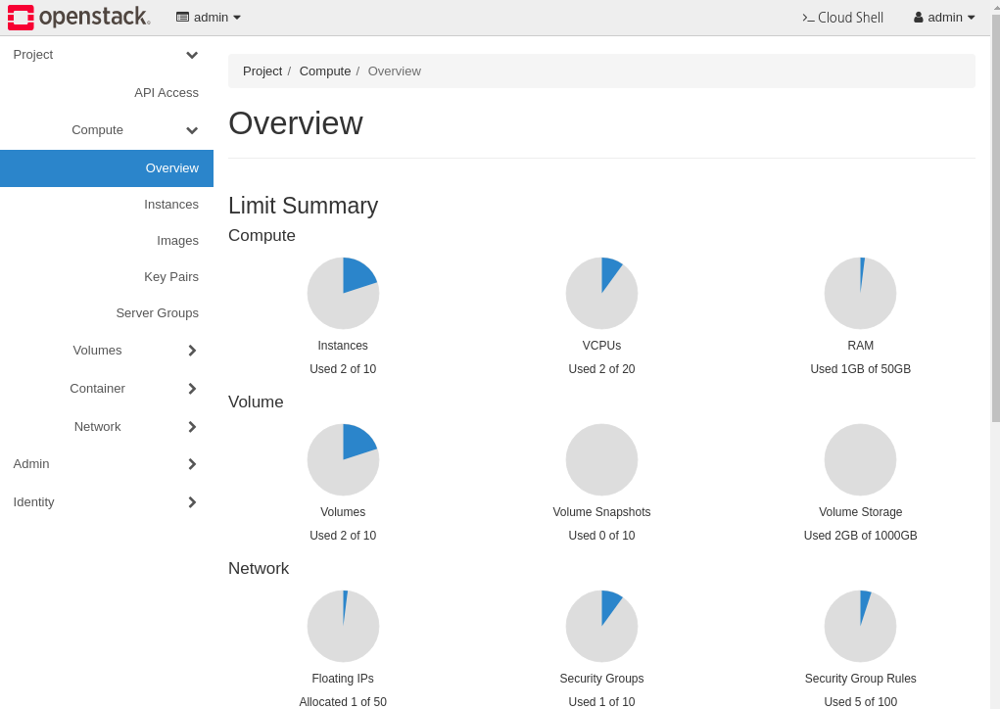

# Introduction
This guide describes things like the following:
  1. how to install OpenStack with zun and kata on ubuntu 20.04 using devstack.
    - Network driver is ovn
    
  2. Navigate and manage the dashboard. 
    - Login
    - Create network
    - Create containers
    - Check the status of containers is running.

  3. Network test between containers with cli.
    
    - Check the list of containers.
    - Check source/destination ips from containers.
    - Ping between containers.

## Setup OpenStack environment with zun and kaka
```sh
sudo -i
hostnamectl set-hostname zun-kata.test.com
hostnamectl set-hostname zun-kata.test.com --transient


HOST_IP="$(ip -4 -o a | grep brd | head -n1 | awk '{print $4}' | cut -f1 -d'/')"
sudo echo "$HOST_IP  zun-kata.test.com zun-kata" >> /etc/hosts

useradd -s /bin/bash -d /opt/stack -m stack
echo "stack ALL=(ALL) NOPASSWD: ALL" | sudo tee /etc/sudoers.d/stack

su - stack

git clone https://github.com/openstack-dev/devstack /opt/stack/devstack
git clone https://github.com/openstack/zun /opt/stack/zun

cp /opt/stack/zun/devstack/local.conf.sample /opt/stack/devstack/local.conf
cd /opt/stack/devstack

HOST_IP="$(ip -4 -o a | grep brd | head -n1 | awk '{print $4}' | cut -f1 -d'/')"
sed -i "s/HOST_IP=.*/HOST_IP=$HOST_IP/" /opt/stack/devstack/local.conf
sed -i "s/\# ENABLE_KATA_CONTAINERS=True/ENABLE_KATA_CONTAINERS=True/" /opt/stack/devstack/local.conf
sed -i "s/\# enable_plugin zun-ui .*/enable_plugin zun-ui https:\/\/opendev.org\/openstack\/zun-ui \$TARGET_BRANCH/" /opt/stack/devstack/local.conf

./stack.sh
```

## Navigate and manage dashboard
1. login Page


2. Overivew



3. Create network


4. Create two cirros containers

4.1 Enter name and images.


4.2 Choose the network


4.3 Check the running container


## Network test between containers with CLI
```sh
$ zun list
+--------------------------------------+---------+--------+---------+------------+--------------+-------+
| uuid                                 | name    | image  | status  | task_state | addresses    | ports |
+--------------------------------------+---------+--------+---------+------------+--------------+-------+
| 315cde59-1d03-4cf3-ad40-7a0b8000d83b | cirros1 | cirros | Running | None       | 55.55.55.222 | []    |
| 60a6347e-9e2a-41e7-8967-b6d7e15dde48 | cirros2 | cirros | Running | None       | 55.55.55.108 | []    |
+--------------------------------------+---------+--------+---------+------------+--------------+-------+

$ docker ps | grep zun
ee8aae72bb49   cirros:latest   "/sbin/init"   27 minutes ago   Up 27 minutes             zun-60a6347e-9e2a-41e7-8967-b6d7e15dde48
9ecad347d918   cirros:latest   "/sbin/init"   27 minutes ago   Up 27 minutes             zun-315cde59-1d03-4cf3-ad40-7a0b8000d83b

$ docker exec ee8aae72bb49 ip a
1: lo: <LOOPBACK,UP,LOWER_UP> mtu 65536 qdisc noqueue qlen 1000
    link/loopback 00:00:00:00:00:00 brd 00:00:00:00:00:00
    inet 127.0.0.1/8 scope host lo
       valid_lft forever preferred_lft forever
    inet6 ::1/128 scope host 
       valid_lft forever preferred_lft forever
2: dummy0: <BROADCAST,NOARP> mtu 1500 qdisc noop qlen 1000
    link/ether b2:e2:87:4e:9a:c4 brd ff:ff:ff:ff:ff:ff
3: eth0: <BROADCAST,MULTICAST,UP,LOWER_UP> mtu 1442 qdisc fq qlen 1000
    link/ether fa:16:3e:1a:99:04 brd ff:ff:ff:ff:ff:ff
    inet 55.55.55.108/24 brd 55.55.55.255 scope global eth0
       valid_lft forever preferred_lft forever
    inet6 fe80::f816:3eff:fe1a:9904/64 scope link 
       valid_lft forever preferred_lft forever

$ docker exec ee8aae72bb49 ping 55.55.55.222
PING 55.55.55.222 (55.55.55.222): 56 data bytes
64 bytes from 55.55.55.222: seq=0 ttl=64 time=2.383 ms
64 bytes from 55.55.55.222: seq=1 ttl=64 time=0.751 ms
64 bytes from 55.55.55.222: seq=2 ttl=64 time=0.368 ms
64 bytes from 55.55.55.222: seq=3 ttl=64 time=0.462 ms
^C
```


# Below lines from this will be managed on another page.
## Adding port(ens4) to the external bridge(br-ex)
```sh
ovs-vsctl --may-exist add-br br-ex -- set bridge br-ex \
  protocols=OpenFlow13
```

## Mapping pubilc:br-ex to go though external.
```sh
ovs-vsctl set open . external-ids:ovn-bridge-mappings=public:br-ex
ovs-vsctl --may-exist add-port br-ex ens4
```
## Creating external network named public 
```sh
openstack network create --external --share \
  --provider-physical-network public --provider-network-type flat \
  public
```
## Creating ip range for external network
```sh
openstack subnet create --network public --subnet-range \
  192.168.103.0/24 --allocation-pool start=192.168.103.151,end=192.168.103.160 \
  --dns-nameserver 8.8.8.8 --gateway 192.168.103.1 public-sub
```  
  
